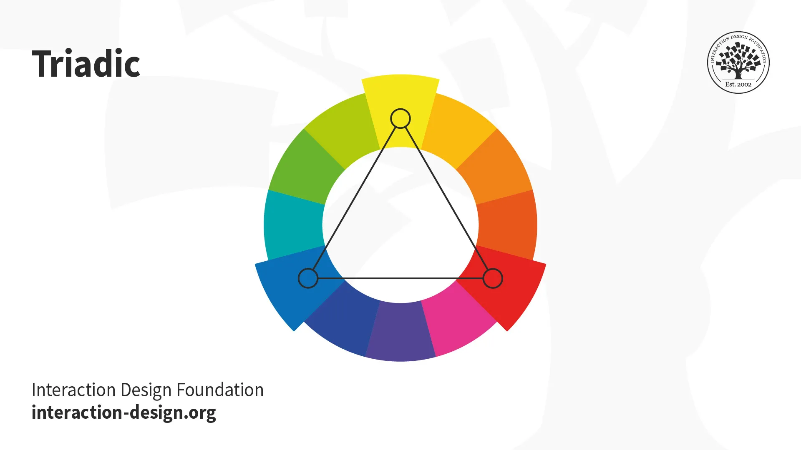
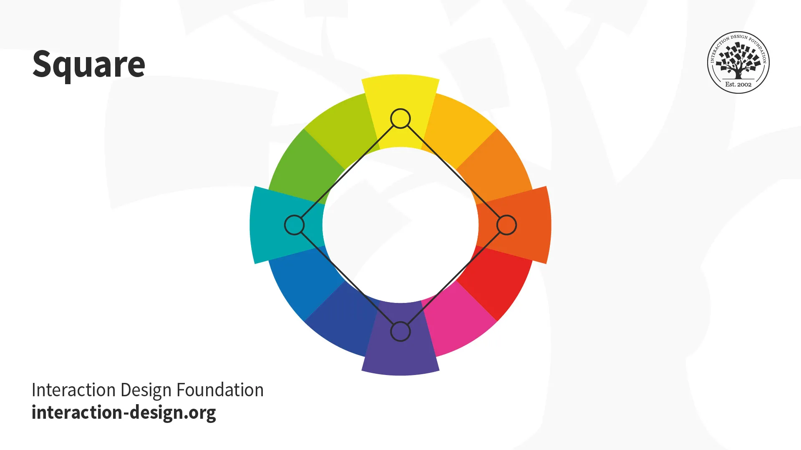

# Web I. beadandó

**Készítette**
*Bunghardt Krisztián (B40T6A)*
*Programtervező Informatikus hallgató*
*2024.09.17*

---
## Tartalom
- **[Leírás](#leírás)**
- **[Tervezett Oldalak](#az-oldalak-és-a-tervezett-tartalom)**
    - [Home](#home)
    - [History](#history)
    - [Color Scheme](#color-scheme)
    - [Color Palettes](#color-palettes)
    - [Contact](#contact)

---
## Leírás

- **Feladat:** Készítsen szerver nélküli legalább 4 oldalból álló honlapot a megadott kritériumok alapján HTML, CSS és JS használatával!

- **Téma:** Color Theory (Szín elmélet)

- **Források:**
    * [Interaction Design Foundation](https://www.interaction-design.org/literature/topics/color-theory)
    * [Wikipedia](https://en.wikipedia.org/wiki/Color_theory)
    * [Icons8](https://icons8.com) (ikonok)
    * [Microsoft Copilot](https://copilot.microsoft.com/) (képek)
    * [Gemini](https://gemini.google.com/) (ötletek, szintaktika)
    * [W3Schools](https://www.w3schools.com/colors/colors_palettes.asp) (színpaletta és szintaktika)

---
## Az oldalak és a tervezett tartalom

### Home
`index.html`

> What is Color Theory?

> Color theory is the study of how colors work together and how they affect our emotions and perceptions. It's like a toolbox for artists, designers, and creators to help them choose the right colors for their projects. Color theory enables you to pick colors that go well together and convey the right mood or message in your work.

**[VIDEO HELYE]**

> 
> Choosing the right color scheme is key to creating visually appealing and user-friendly interfaces. Read more about it here.

> 
> Find stunning color palettes curated for different design styles. Click here to get inspired!

> 
> Get in Touch! Have a question or need assistance? Contact our friendly team.

### History
`./pages/history.html`

> **History**
> Color theory is rooted in antiquity, with early musings on color in Aristotle's (d. 322 BCE) On Colors and Claudius Ptolemy's (d. 168 CE) Optics. The influence of light on color was investigated and revealed further by al-Kindi (d. 873) and Ibn al-Haytham (d. 1039). Ibn Sina (d. 1037), Nasir al-Din al-Tusi (d. 1274), and Robert Grosseteste (d. 1253) discovered that contrary to the teachings of Aristotle, there are multiple color paths to get from black to white. More modern approaches to color theory principles can be found in the writings of Leone Battista Alberti (c. 1435) and the notebooks of Leonardo da Vinci (c. 1490).

> Goethe's color wheel from his 1810 Theory of Colours
The RYB primary colors became the foundation of 18th-century theories of color vision, as the fundamental sensory qualities that are blended in the perception of all physical colors, and conversely, in the physical mixture of pigments or dyes. These theories were enhanced by 18th-century investigations of a variety of purely psychological color effects, in particular the contrast between "complementary" or opposing hues that are produced by color afterimages and in the contrasting shadows in colored light. These ideas and many personal color observations were summarized in two founding documents in color theory: the Theory of Colours (1810) by the German poet Johann Wolfgang von Goethe, and The Law of Simultaneous Color Contrast (1839) by the French industrial chemist Michel Eugène Chevreul. Charles Hayter published A New Practical Treatise on the Three Primitive Colours Assumed as a Perfect System of Rudimentary Information (London 1826), in which he described how all colors could be obtained from just three.

> Page from 1826 A New Practical Treatise on the Three Primitive Colours Assumed as a Perfect System of Rudimentary Information by Charles Hayter
Subsequently, German and English scientists established in the late 19th century that color perception is best described in terms of a different set of primary colors—red, green and blue-violet (RGB)—modeled through the additive mixture of three monochromatic lights. Subsequent research anchored these primary colors in the differing responses to light by three types of color receptors or cones in the retina (trichromacy). On this basis the quantitative description of the color mixture or colorimetry developed in the early 20th century, along with a series of increasingly sophisticated models of color space and color perception, such as the opponent process theory.

> Across the same period, industrial chemistry radically expanded the color range of lightfast synthetic pigments, allowing for substantially improved saturation in color mixtures of dyes, paints, and inks. It also created the dyes and chemical processes necessary for color photography. As a result, three-color printing became aesthetically and economically feasible in mass printed media, and the artists' color theory was adapted to primary colors most effective in inks or photographic dyes: cyan, magenta, and yellow (CMY). (In printing, dark colors are supplemented by black ink, known as the CMYK system; in both printing and photography, white is provided by the color of the paper.) These CMY primary colors were reconciled with the RGB primaries, and subtractive color mixing with additive color mixing, by defining the CMY primaries as substances that absorbed only one of the retinal primary colors: cyan absorbs only red (−R+G+B), magenta only green (+R−G+B), and yellow only blue-violet (+R+G−B). It is important to add that the CMYK, or process, color printing is meant as an economical way of producing a wide range of colors for printing, but is deficient in reproducing certain colors, notably orange and slightly deficient in reproducing purples. A wider range of colors can be obtained with the addition of other colors to the printing process, such as in Pantone's Hexachrome printing ink system (six colors), among others.

> Munsell's 1905 color system represents colors using three color-making attributes, value (lightness), chroma, and hue.
For much of the 19th century artistic color theory either lagged behind scientific understanding or was augmented by science books written for the lay public, in particular Modern Chromatics (1879) by the American physicist Ogden Rood, and early color atlases developed by Albert Munsell (Munsell Book of Color, 1915, see Munsell color system) and Wilhelm Ostwald (Color Atlas, 1919). Major advances were made in the early 20th century by artists teaching or associated with the German Bauhaus, in particular Wassily Kandinsky, Johannes Itten, Faber Birren and Josef Albers, whose writings mix speculation with an empirical or demonstration-based study of color design principles.

### Color Scheme
`./pages/color_scheme.html`

> **Color Scheme**
> In screen design, designers use the additive color model, where red, green and blue are the primary colors. Just as you need to place images and other elements in visual design strategically, your color choices should optimize your users’ experience in attractive interfaces with high usability. When starting your design process, you can consider using any of these main color schemes:

> - **Monochromatic**

Take one hue and create other elements from different shades and tints of it.

> - **Analogous**

Use three colors located beside one another on the color wheel (e.g., orange, yellow-orange and yellow to show sunlight). A variant is to mix white with these to form a “high-key” analogous color scheme (e.g., flames).   

> - **Complementary**

Use “opposite color” pairs—e.g., blue/yellow—to maximize contrast.

> - **Split-Complementary**

Add colors from either side of your complementary color pair to soften the contrast.   

> - **Triadic**

Take three equally distant colors on the color wheel (i.e., 120° apart: e.g., red/blue/yellow). These colors may not be vibrant, but the scheme can be as it maintains harmony and high contrast. It’s easier to make visually appealing designs with this scheme than with a complementary scheme.   

> - **Tetradic**

Take four colors that are two sets of complementary pairs (e.g., orange/yellow/blue/violet) and choose one dominant color. This allows rich, interesting designs. However, watch the   
 balance between warm and cool colors.   

> - **Square**

A variant of tetradic; you find four colors evenly spaced on the color wheel (i.e., 90° apart). Unlike tetradic, square schemes can work well if you use all four colors evenly.   

> Your colors must reflect your design’s goal and the brand’s personality. You should also apply color theory to optimize a positive psychological impact on users. So, you should carefully determine how the color temperature (i.e., your use of warm, neutral and cool colors) reflects your message.

[+ INTERAKTÍV JS COLOR WHEEL]

### Color Palettes
`./pages/color_palettes.html`
> **Color Palettes**
> Find stunning color palettes curated for different design styles. Get inspired and elevate your projects with these thoughtfully selected color combinations.

<table class='color_palettes'><thead><tr><th>HEX</th><th>RGB</th></tr></thead><tbody><tr style='background-color: #a2b9bc;'><td>#a2b9bc</td><td>rgb(162, 185, 188)</td></tr><tr style='background-color: #b2ad7f;'><td>#b2ad7f</td><td>rgb(178, 173, 127)</td></tr><tr style='background-color: #878f99;'><td>#878f99</td><td>rgb(135, 143, 153)</td></tr><tr style='background-color: #6b5b95;'><td>#6b5b95</td><td>rgb(107, 91, 149)</td></tr></tbody></table><table class='color_palettes'><thead><tr><th>HEX</th><th>RGB</th></tr></thead><tbody><tr style='background-color: #6b5b95;'><td>#6b5b95</td><td>rgb(107, 91, 149)</td></tr><tr style='background-color: #feb236;'><td>#feb236</td><td>rgb(254, 178, 54)</td></tr><tr style='background-color: #d64161;'><td>#d64161</td><td>rgb(214, 65, 97)</td></tr><tr style='background-color: #ff7b25;'><td>#ff7b25</td><td>rgb(255, 123, 37)</td></tr></tbody></table><table class='color_palettes'><thead><tr><th>HEX</th><th>RGB</th></tr></thead><tbody><tr style='background-color: #d6cbd3;'><td>#d6cbd3</td><td>rgb(214, 203, 211)</td></tr><tr style='background-color: #eca1a6;'><td>#eca1a6</td><td>rgb(236, 161, 166)</td></tr><tr style='background-color: #bdcebe;'><td>#bdcebe</td><td>rgb(189, 206, 190)</td></tr><tr style='background-color: #ada397;'><td>#ada397</td><td>rgb(173, 163, 151)</td></tr></tbody></table><table class='color_palettes'><thead><tr><th>HEX</th><th>RGB</th></tr></thead><tbody><tr style='background-color: #d5e1df;'><td>#d5e1df</td><td>rgb(213, 225, 223)</td></tr><tr style='background-color: #e3eaa7;'><td>#e3eaa7</td><td>rgb(227, 234, 167)</td></tr><tr style='background-color: #b5e7a0;'><td>#b5e7a0</td><td>rgb(181, 231, 160)</td></tr><tr style='background-color: #86af49;'><td>#86af49</td><td>rgb(134, 175, 73)</td></tr></tbody></table><table class='color_palettes'><thead><tr><th>HEX</th><th>RGB</th></tr></thead><tbody><tr style='background-color: #b9936c;'><td>#b9936c</td><td>rgb(185, 147, 108)</td></tr><tr style='background-color: #dac292;'><td>#dac292</td><td>rgb(218, 194, 146)</td></tr><tr style='background-color: #e6e2d3;'><td>#e6e2d3</td><td>rgb(230, 226, 211)</td></tr><tr style='background-color: #c4b7a6;'><td>#c4b7a6</td><td>rgb(196, 183, 166)</td></tr></tbody></table><table class='color_palettes'><thead><tr><th>HEX</th><th>RGB</th></tr></thead><tbody><tr style='background-color: #3e4444;'><td>#3e4444</td><td>rgb(62, 68, 68)</td></tr><tr style='background-color: #82b74b;'><td>#82b74b</td><td>rgb(130, 183, 75)</td></tr><tr style='background-color: #405d27;'><td>#405d27</td><td>rgb(64, 93, 39)</td></tr><tr style='background-color: #c1946a;'><td>#c1946a</td><td>rgb(193, 148, 106)</td></tr></tbody></table><table class='color_palettes'><thead><tr><th>HEX</th><th>RGB</th></tr></thead><tbody><tr style='background-color: #92a8d1;'><td>#92a8d1</td><td>rgb(146, 168, 209)</td></tr><tr style='background-color: #034f84;'><td>#034f84</td><td>rgb(3, 79, 132)</td></tr><tr style='background-color: #f7cac9;'><td>#f7cac9</td><td>rgb(247, 202, 201)</td></tr><tr style='background-color: #f7786b;'><td>#f7786b</td><td>rgb(247, 120, 107)</td></tr></tbody></table><table class='color_palettes'><thead><tr><th>HEX</th><th>RGB</th></tr></thead><tbody><tr style='background-color: #deeaee;'><td>#deeaee</td><td>rgb(222, 234, 238)</td></tr><tr style='background-color: #b1cbbb;'><td>#b1cbbb</td><td>rgb(177, 203, 187)</td></tr><tr style='background-color: #eea29a;'><td>#eea29a</td><td>rgb(238, 162, 154)</td></tr><tr style='background-color: #c94c4c;'><td>#c94c4c</td><td>rgb(201, 76, 76)</td></tr></tbody></table><table class='color_palettes'><thead><tr><th>HEX</th><th>RGB</th></tr></thead><tbody><tr style='background-color: #d5f4e6;'><td>#d5f4e6</td><td>rgb(213, 244, 230)</td></tr><tr style='background-color: #80ced6;'><td>#80ced6</td><td>rgb(128, 206, 214)</td></tr><tr style='background-color: #fefbd8;'><td>#fefbd8</td><td>rgb(254, 251, 216)</td></tr><tr style='background-color: #618685;'><td>#618685</td><td>rgb(97, 134, 133)</td></tr></tbody></table><table class='color_palettes'><thead><tr><th>HEX</th><th>RGB</th></tr></thead><tbody><tr style='background-color: #ffef96;'><td>#ffef96</td><td>rgb(255, 239, 150)</td></tr><tr style='background-color: #50394c;'><td>#50394c</td><td>rgb(80, 57, 76)</td></tr><tr style='background-color: #b2b2b2;'><td>#b2b2b2</td><td>rgb(178, 178, 178)</td></tr><tr style='background-color: #f4e1d2;'><td>#f4e1d2</td><td>rgb(244, 225, 210)</td></tr></tbody></table><table class='color_palettes'><thead><tr><th>HEX</th><th>RGB</th></tr></thead><tbody><tr style='background-color: #fefbd8;'><td>#fefbd8</td><td>rgb(254, 251, 216)</td></tr><tr style='background-color: #618685;'><td>#618685</td><td>rgb(97, 134, 133)</td></tr><tr style='background-color: #36486b;'><td>#36486b</td><td>rgb(54, 72, 107)</td></tr><tr style='background-color: #4040a1;'><td>#4040a1</td><td>rgb(64, 64, 161)</td></tr></tbody></table><table class='color_palettes'><thead><tr><th>HEX</th><th>RGB</th></tr></thead><tbody><tr style='background-color: #b2b2b2;'><td>#b2b2b2</td><td>rgb(178, 178, 178)</td></tr><tr style='background-color: #f4e1d2;'><td>#f4e1d2</td><td>rgb(244, 225, 210)</td></tr><tr style='background-color: #f18973;'><td>#f18973</td><td>rgb(241, 137, 115)</td></tr><tr style='background-color: #bc5a45;'><td>#bc5a45</td><td>rgb(188, 90, 69)</td></tr></tbody></table><table class='color_palettes'><thead><tr><th>HEX</th><th>RGB</th></tr></thead><tbody><tr style='background-color: #f0f0f0;'><td>#f0f0f0</td><td>rgb(240, 240, 240)</td></tr><tr style='background-color: #c5d5c5;'><td>#c5d5c5</td><td>rgb(197, 213, 197)</td></tr><tr style='background-color: #9fa9a3;'><td>#9fa9a3</td><td>rgb(159, 169, 163)</td></tr><tr style='background-color: #e3e0cc;'><td>#e3e0cc</td><td>rgb(227, 224, 204)</td></tr></tbody></table><table class='color_palettes'><thead><tr><th>HEX</th><th>RGB</th></tr></thead><tbody><tr style='background-color: #eaece5;'><td>#eaece5</td><td>rgb(234, 236, 229)</td></tr><tr style='background-color: #b2c2bf;'><td>#b2c2bf</td><td>rgb(178, 194, 191)</td></tr><tr style='background-color: #c0ded9;'><td>#c0ded9</td><td>rgb(192, 222, 217)</td></tr><tr style='background-color: #3b3a30;'><td>#3b3a30</td><td>rgb(59, 58, 48)</td></tr></tbody></table><table class='color_palettes'><thead><tr><th>HEX</th><th>RGB</th></tr></thead><tbody><tr style='background-color: #e4d1d1;'><td>#e4d1d1</td><td>rgb(228, 209, 209)</td></tr><tr style='background-color: #b9b0b0;'><td>#b9b0b0</td><td>rgb(185, 176, 176)</td></tr><tr style='background-color: #d9ecd0;'><td>#d9ecd0</td><td>rgb(217, 236, 208)</td></tr><tr style='background-color: #77a8a8;'><td>#77a8a8</td><td>rgb(119, 168, 168)</td></tr></tbody></table><table class='color_palettes'><thead><tr><th>HEX</th><th>RGB</th></tr></thead><tbody><tr style='background-color: #f0efef;'><td>#f0efef</td><td>rgb(240, 239, 239)</td></tr><tr style='background-color: #ddeedd;'><td>#ddeedd</td><td>rgb(221, 238, 221)</td></tr><tr style='background-color: #c2d4dd;'><td>#c2d4dd</td><td>rgb(194, 212, 221)</td></tr><tr style='background-color: #b0aac0;'><td>#b0aac0</td><td>rgb(176, 170, 192)</td></tr></tbody></table><table class='color_palettes'><thead><tr><th>HEX</th><th>RGB</th></tr></thead><tbody><tr style='background-color: #c8c3cc;'><td>#c8c3cc</td><td>rgb(200, 195, 204)</td></tr><tr style='background-color: #563f46;'><td>#563f46</td><td>rgb(86, 63, 70)</td></tr><tr style='background-color: #8ca3a3;'><td>#8ca3a3</td><td>rgb(140, 163, 163)</td></tr><tr style='background-color: #484f4f;'><td>#484f4f</td><td>rgb(72, 79, 79)</td></tr></tbody></table><table class='color_palettes'><thead><tr><th>HEX</th><th>RGB</th></tr></thead><tbody><tr style='background-color: #e0e2e4;'><td>#e0e2e4</td><td>rgb(224, 226, 228)</td></tr><tr style='background-color: #c6bcb6;'><td>#c6bcb6</td><td>rgb(198, 188, 182)</td></tr><tr style='background-color: #96897f;'><td>#96897f</td><td>rgb(150, 137, 127)</td></tr><tr style='background-color: #625750;'><td>#625750</td><td>rgb(98, 87, 80)</td></tr></tbody></table><table class='color_palettes'><thead><tr><th>HEX</th><th>RGB</th></tr></thead><tbody><tr style='background-color: #7e4a35;'><td>#7e4a35</td><td>rgb(126, 74, 53)</td></tr><tr style='background-color: #cab577;'><td>#cab577</td><td>rgb(202, 181, 119)</td></tr><tr style='background-color: #dbceb0;'><td>#dbceb0</td><td>rgb(219, 206, 176)</td></tr><tr style='background-color: #838060;'><td>#838060</td><td>rgb(131, 128, 96)</td></tr></tbody></table><table class='color_palettes'><thead><tr><th>HEX</th><th>RGB</th></tr></thead><tbody><tr style='background-color: #bbab9b;'><td>#bbab9b</td><td>rgb(187, 171, 155)</td></tr><tr style='background-color: #8b6f47;'><td>#8b6f47</td><td>rgb(139, 111, 71)</td></tr><tr style='background-color: #d4ac6e;'><td>#d4ac6e</td><td>rgb(212, 172, 110)</td></tr><tr style='background-color: #4f3222;'><td>#4f3222</td><td>rgb(79, 50, 34)</td></tr></tbody></table><table class='color_palettes'><thead><tr><th>HEX</th><th>RGB</th></tr></thead><tbody><tr style='background-color: #686256;'><td>#686256</td><td>rgb(104, 98, 86)</td></tr><tr style='background-color: #c1502e;'><td>#c1502e</td><td>rgb(193, 80, 46)</td></tr><tr style='background-color: #587e76;'><td>#587e76</td><td>rgb(88, 126, 118)</td></tr><tr style='background-color: #a96e5b;'><td>#a96e5b</td><td>rgb(169, 110, 91)</td></tr></tbody></table><table class='color_palettes'><thead><tr><th>HEX</th><th>RGB</th></tr></thead><tbody><tr style='background-color: #454140;'><td>#454140</td><td>rgb(69, 65, 64)</td></tr><tr style='background-color: #bd5734;'><td>#bd5734</td><td>rgb(189, 87, 52)</td></tr><tr style='background-color: #a79e84;'><td>#a79e84</td><td>rgb(167, 158, 132)</td></tr><tr style='background-color: #7a3b2e;'><td>#7a3b2e</td><td>rgb(122, 59, 46)</td></tr></tbody></table><table class='color_palettes'><thead><tr><th>HEX</th><th>RGB</th></tr></thead><tbody><tr style='background-color: #bccad6;'><td>#bccad6</td><td>rgb(188, 202, 214)</td></tr><tr style='background-color: #8d9db6;'><td>#8d9db6</td><td>rgb(141, 157, 182)</td></tr><tr style='background-color: #667292;'><td>#667292</td><td>rgb(102, 114, 146)</td></tr><tr style='background-color: #f1e3dd;'><td>#f1e3dd</td><td>rgb(241, 227, 221)</td></tr></tbody></table><table class='color_palettes'><thead><tr><th>HEX</th><th>RGB</th></tr></thead><tbody><tr style='background-color: #cfe0e8;'><td>#cfe0e8</td><td>rgb(207, 224, 232)</td></tr><tr style='background-color: #b7d7e8;'><td>#b7d7e8</td><td>rgb(183, 215, 232)</td></tr><tr style='background-color: #87bdd8;'><td>#87bdd8</td><td>rgb(135, 189, 216)</td></tr><tr style='background-color: #daebe8;'><td>#daebe8</td><td>rgb(218, 235, 232)</td></tr></tbody></table><table class='color_palettes'><thead><tr><th>HEX</th><th>RGB</th></tr></thead><tbody><tr style='background-color: #fbefcc;'><td>#fbefcc</td><td>rgb(251, 239, 204)</td></tr><tr style='background-color: #f9ccac;'><td>#f9ccac</td><td>rgb(249, 204, 172)</td></tr><tr style='background-color: #f4a688;'><td>#f4a688</td><td>rgb(244, 166, 136)</td></tr><tr style='background-color: #e0876a;'><td>#e0876a</td><td>rgb(224, 135, 106)</td></tr></tbody></table><table class='color_palettes'><thead><tr><th>HEX</th><th>RGB</th></tr></thead><tbody><tr style='background-color: #fff2df;'><td>#fff2df</td><td>rgb(255, 242, 223)</td></tr><tr style='background-color: #d9ad7c;'><td>#d9ad7c</td><td>rgb(217, 173, 124)</td></tr><tr style='background-color: #a2836e;'><td>#a2836e</td><td>rgb(162, 131, 110)</td></tr><tr style='background-color: #674d3c;'><td>#674d3c</td><td>rgb(103, 77, 60)</td></tr></tbody></table><table class='color_palettes'><thead><tr><th>HEX</th><th>RGB</th></tr></thead><tbody><tr style='background-color: #f9d5e5;'><td>#f9d5e5</td><td>rgb(249, 213, 229)</td></tr><tr style='background-color: #eeac99;'><td>#eeac99</td><td>rgb(238, 172, 153)</td></tr><tr style='background-color: #e06377;'><td>#e06377</td><td>rgb(224, 99, 119)</td></tr><tr style='background-color: #c83349;'><td>#c83349</td><td>rgb(200, 51, 73)</td></tr></tbody></table><table class='color_palettes'><thead><tr><th>HEX</th><th>RGB</th></tr></thead><tbody><tr style='background-color: #5b9aa0;'><td>#5b9aa0</td><td>rgb(91, 154, 160)</td></tr><tr style='background-color: #d6d4e0;'><td>#d6d4e0</td><td>rgb(214, 212, 224)</td></tr><tr style='background-color: #b8a9c9;'><td>#b8a9c9</td><td>rgb(184, 169, 201)</td></tr><tr style='background-color: #622569;'><td>#622569</td><td>rgb(98, 37, 105)</td></tr></tbody></table><table class='color_palettes'><thead><tr><th>HEX</th><th>RGB</th></tr></thead><tbody><tr style='background-color: #96ceb4;'><td>#96ceb4</td><td>rgb(150, 206, 180)</td></tr><tr style='background-color: #ffeead;'><td>#ffeead</td><td>rgb(255, 238, 173)</td></tr><tr style='background-color: #ffcc5c;'><td>#ffcc5c</td><td>rgb(255, 204, 92)</td></tr><tr style='background-color: #ff6f69;'><td>#ff6f69</td><td>rgb(255, 111, 105)</td></tr></tbody></table><table class='color_palettes'><thead><tr><th>HEX</th><th>RGB</th></tr></thead><tbody><tr style='background-color: #588c7e;'><td>#588c7e</td><td>rgb(88, 140, 126)</td></tr><tr style='background-color: #f2e394;'><td>#f2e394</td><td>rgb(242, 227, 148)</td></tr><tr style='background-color: #f2ae72;'><td>#f2ae72</td><td>rgb(242, 174, 114)</td></tr><tr style='background-color: #d96459;'><td>#d96459</td><td>rgb(217, 100, 89)</td></tr></tbody></table>

### Contact
`./pages/contact_me.html`

> If you have any questions about this project, or if you'd like to discuss other aspects of web development, feel free to contact me!

**ŰRLAP TARTALMA:**

|Name: [input text]                      | Reason For Contact: [radio buttons]|
|E-mail: [input mail]                    | - General Inquiry                  |
|[text area]                             | - Color Consultation               |
|[checkbox] Subscribe to our newsletter  | - Feedback or Suggestion           |
|                                        | - Technical Issue                  |
|[Button] Submit, [Button] Reset         | - Other                            |